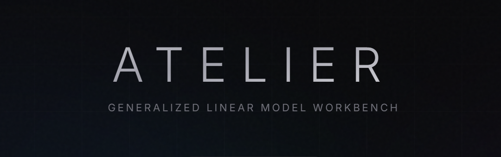

<div align="center">

# Atelier

**Browser-based GLM workbench for actuarial pricing**

Build, fit, diagnose, and iterate on Generalized Linear Models — without leaving your browser.

[](https://www.python.org/downloads/)
[](LICENSE)
[](https://github.com/PricingFrontier/rustystats)



</div>

---

## Why Atelier?

Actuarial pricing teams deserve modern tooling. Atelier wraps [rustystats](https://github.com/PricingFrontier/rustystats) — a high-performance Rust-backed GLM engine — in a clean, interactive UI designed for the model-building workflow.

- **One command** — `uv add atel`, run `atel`, and you're in the browser. No Docker, no Node.js, no config files.
- **Fast** — Rust-powered fitting is 5–20x faster than statsmodels. Iterate in seconds, not minutes.
- **Visual** — Factor charts, actual-vs-expected, lift curves, diagnostics, and model comparison — all live-updating as you build.
- **Transparent** — Every model action generates runnable Python code. Copy it, version it, schedule it.
- **Local** — Your data never leaves your machine. No accounts, no cloud, no telemetry.

---

## Installation

```bash
uv add atelier
# or
pip install atel
```

> Requires **Python 3.13+**. Installs everything — backend, frontend, engine. No separate build steps.

## Quick start

```bash
atel                  # starts server, opens browser
atel --port 9000      # custom port
atel --no-browser     # headless / server-only
```

The `atelier` command works too - `atel` is just shorter.

---

## Features

### Model building

- **8 GLM families** — Gaussian, Poisson, Binomial, Gamma, Tweedie, Quasi-Poisson, Quasi-Binomial, Negative Binomial
- **Rich term types** — categorical, linear, B-splines, natural splines, target encoding, frequency encoding, expressions
- **Monotonic constraints** — enforce increasing/decreasing effects on splines and linear terms
- **Interactions** — standard product terms, target-encoded interactions, frequency-encoded interactions
- **Regularization** — Ridge, Lasso, Elastic Net with cross-validated alpha selection
- **Train/test split** — holdout validation with stratified splitting

### Diagnostics

- **Factor-level A/E** — actual vs expected charts for every factor, fitted or not
- **Score tests** — chi-squared significance for candidate factors before fitting
- **Lift charts** — Gini, AUC, KS statistics with decile breakdown
- **Calibration** — Hosmer-Lemeshow test, decile calibration with confidence intervals
- **Residual analysis** — deviance, Pearson, and working residuals
- **VIF & multicollinearity** — variance inflation factors with severity coloring
- **Model comparison** — side-by-side metrics against a base model

### Data exploration

- **Pre-fit analysis** — response distribution, zero inflation, overdispersion detection
- **Correlation matrix** — numeric correlations and Cramér's V for categoricals
- **Shape detection** — automatic recommendations for term types per factor
- **Interaction detection** — greedy residual-based search for potential interactions

### Workflow

- **Model history** — every fit is saved and versioned, compare any two iterations
- **Context menus** — right-click factors to change term types, toggle inclusion, reorder
- **Keyboard-driven** — search, filter, and navigate without reaching for the mouse
- **Code generation** — live Python script panel mirrors your UI actions

---

## How it works

```
┌─────────────────────────────────────┐
│  Browser (React + TypeScript)       │
│  ┌──────────┬──────────┬──────────┐ │
│  │  Spec    │ Results  │  Code    │ │
│  │  Panel   │  Panel   │  Panel   │ │
│  └──────────┴──────────┴──────────┘ │
│           REST + WebSocket          │
└──────────────┬──────────────────────┘
               │
┌──────────────┴──────────────────────┐
│  Python backend (FastAPI + uvicorn) │
│  ┌────────────────────────────────┐ │
│  │  rustystats (Rust GLM engine)  │ │
│  └────────────────────────────────┘ │
│  Storage: ~/.atelier/ (SQLite)      │
└─────────────────────────────────────┘
```

Atelier is a single Python package. The React frontend is pre-built and bundled as static assets inside the wheel — no Node.js runtime required. The backend serves the UI and exposes a REST + WebSocket API for model fitting and real-time progress updates.

---

## Development

```bash
git clone https://github.com/PricingFrontier/atelier.git
cd atelier
uv sync

# Backend (API server)
uv run atel --no-browser --port 8457

# Frontend (separate terminal, with hot reload)
cd frontend && npm install && npm run dev
```

Open `http://localhost:5173` for the Vite dev server with HMR proxying API requests to the backend.

### Running tests

```bash
uv run pytest
```

### Building the frontend for production

```bash
cd frontend && npm run build
# Output lands in src/atelier/static/
```

---

## Tech stack

| Layer | Technology |
|-------|-----------|
| **GLM engine** | [rustystats](https://github.com/PricingFrontier/rustystats) (Rust) |
| **Backend** | FastAPI, uvicorn, SQLAlchemy, polars |
| **Frontend** | React 19, TypeScript, Vite, Tailwind CSS, shadcn/ui |
| **Charts** | Plotly.js, Recharts |
| **State** | Zustand |
| **Storage** | SQLite (via aiosqlite) at `~/.atelier/` |

---

## License

[Eclipse Public License 2.0](LICENSE)
