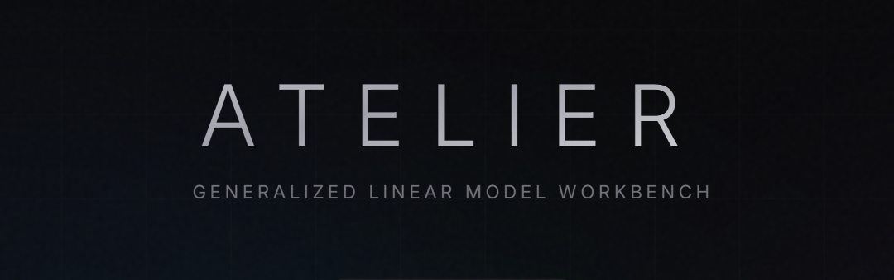

<div align="center">

# Atelier

**Browser-based GLM workbench for actuarial pricing**

Build, fit, diagnose, and iterate on Generalized Linear Models - without leaving your browser.

[](https://www.python.org/downloads/)
[](LICENSE)
[](https://github.com/PricingFrontier/rustystats)



</div>

---

## Why Atelier?

Traditional actuarial pricing tools like Emblem are expensive, opaque, and tied to legacy platforms. Atelier is a modern, open-source alternative that wraps [rustystats](https://github.com/PricingFrontier/rustystats) - a high-performance Rust-backed GLM engine - in a clean, interactive UI. It runs locally, stores everything on your machine, and follows the same explore-build-fit-iterate workflow actuaries already know.

## Installation

```bash
uv add atel
# or
pip install atel
```

Installs everything - backend, frontend, engine. No separate build steps.

## Quick start

```bash
atel                  # starts server, opens browser
atel --port 9000      # custom port
atel --no-browser     # start server only
```

The `atelier` command works too - `atel` is just shorter.

---

## How it works

### Workflow

Atelier follows the standard actuarial modelling workflow:

1. **Upload** - drag-and-drop a CSV or Parquet file, column types are auto-detected
2. **Configure** - select the response variable, GLM family, link function, offset, weights, and train/test split
3. **Explore** - pre-fit analysis runs automatically: response distribution, score tests ranking every candidate factor by expected deviance contribution, and a null (intercept-only) baseline model
4. **Build** - add terms from the factor sidebar: right-click any factor to choose categorical, linear, spline, target encoding, or other term types
5. **Fit** - hit fit, review the results: coefficient table, A/E charts, lift, calibration, VIF, and model diagnostics
6. **Iterate** - modify terms and re-fit. Every fit is auto-versioned so you can compare metrics across iterations and restore any previous version

### Architecture

```
┌─────────────────────────────────────────────┐
│  Browser (React 19 + Tailwind + shadcn/ui)  │
└──────────────────┬──────────────────────────┘
                   │ HTTP/JSON
┌──────────────────▼──────────────────────────┐
│  FastAPI backend                             │
│  ├── /api/datasets   upload, validate        │
│  ├── /api/explore    EDA + null model        │
│  ├── /api/fit        GLM fitting             │
│  ├── /api/models     save, history, restore  │
│  └── /api/projects   project CRUD            │
├──────────────────────────────────────────────┤
│  rustystats          Rust GLM engine         │
├──────────────────────────────────────────────┤
│  SQLite (async)      projects, models, specs │
└──────────────────────────────────────────────┘
```

All data stays local at `~/.atelier/` - the database, uploaded datasets, and serialized models.

---

## Features

### Model building

- **8 GLM families** - Gaussian, Poisson, Binomial, Gamma, Tweedie, Quasi-Poisson, Quasi-Binomial, Negative Binomial
- **Rich term types** - categorical, linear, B-splines, natural splines, target encoding, frequency encoding, expressions
- **Monotonic constraints** - enforce increasing/decreasing effects on splines and linear terms
- **Interactions** - standard product terms, target-encoded interactions, frequency-encoded interactions
- **Regularization** - Ridge, Lasso, Elastic Net with cross-validated alpha selection
- **Train/test split** - holdout validation with stratified splitting

### Diagnostics

- **Factor-level A/E** - actual vs expected charts for every factor, fitted or not
- **Score tests** - chi-squared significance for candidate factors before fitting
- **Lift charts** - Gini, AUC, KS statistics with decile breakdown
- **Calibration** - Hosmer-Lemeshow test, decile calibration with confidence intervals
- **Residual analysis** - deviance, Pearson, and working residuals
- **VIF & multicollinearity** - variance inflation factors with severity coloring
- **Model comparison** - side-by-side train/test metrics against a base model

### Data exploration

- **Pre-fit analysis** - response distribution, zero inflation, overdispersion detection
- **Correlation matrix** - numeric correlations and Cramer's V for categoricals
- **Interaction detection** - greedy residual-based search for potential interactions

### Version control

- **Auto-versioning** - every fit is saved as a new version with full spec, coefficients, and diagnostics
- **Change tracking** - history panel shows terms added, removed, or modified between versions
- **Restore** - click any version to restore its terms and results, then continue iterating

---

## License

[Eclipse Public License 2.0](LICENSE)
